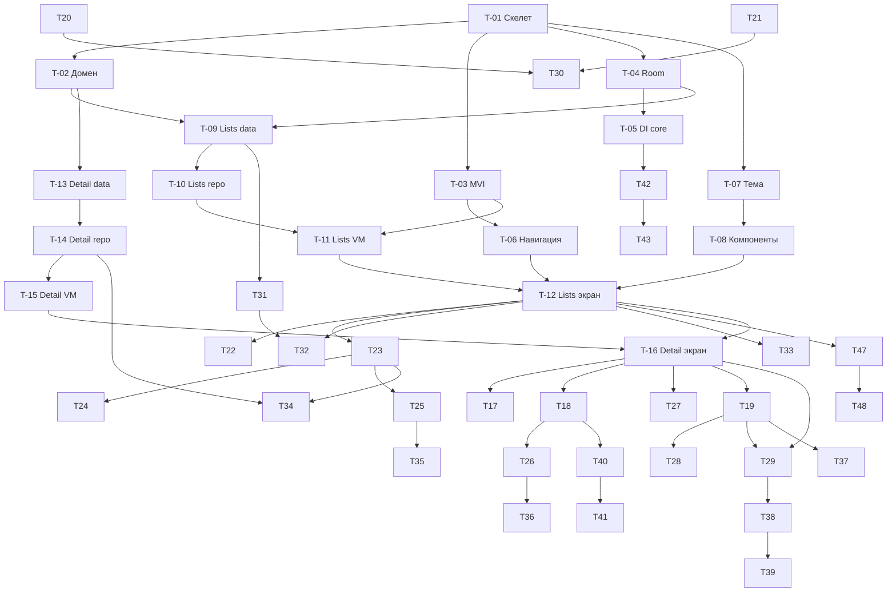

# Список покупок — backlog (декомпозиция задач)

> Декомпозиция всех требований в задачи для GitHub-борда. Источники:
> [functional-requirements.md](functional-requirements.md) (FR/NFR),
> [architecture.md](architecture.md) (структура), [design.md](design.md) (экраны/Figma).
> Учебный проект, делается по вечерам. Все задачи — единым списком, без жёсткого
> разбиения по неделям; порядок определяется приоритетом и зависимостями.

**Прототип Figma:** [UI-kit](https://figma.com/design/n84usOH28EjTrPXrfCzM3q/Практикум-ОП-Список-покупок)

---

## Легенда

- **Приоритет:**
  - `P0` — **наивысший**: задача блокирует другие задачи (критический путь) или фундамент.
    Берётся в работу в первую очередь.
  - `P1` — **высокий**: обязательная задача (Обязательное FR / обязательный NFR). Как правило
    не на критическом пути; исключение — **T-23** (свайп-ряд): единственная в макете точка входа
    к обязательным переименованию/удалению, поэтому блокирует T-24/T-25/T-34.
  - `P2` — **минимальный**: опциональная задача (Опционально), берётся в последнюю очередь.
- **Сложность** (трудность, не время): `S` — рутина/бойлерплейт, `M` — обычная фича,
  `L` — требует аккуратности (нетривиальная логика/жесты/конфигурация).
- **Оценка** — примерные человеко-часы; каждая задача укладывается в один-два вечера (≤5ч).
- **Блокируется / Блокирует** — зависимости между задачами по ID.
- **Макет Figma** — прямые ссылки на фреймы прототипа.

### Принцип декомпозиции
Задача = один логический результат за один-два вечера (слой данных одной фичи, один экран,
одна шторка/действие). Большие экраны разбиты на: данные → репозиторий → ViewModel →
отрисовка → отдельные действия. Так задачи не пересекаются и их легко ревьюить.

### Метки для борда
`priority:P0|P1|P2` · `complexity:S|M|L` ·
`area:core|onboarding|lists|listdetail|nfr` · `type:setup|feature|nfr|qa` ·
`optional` (на все опциональные задачи — P2)

---

## Definition of Done (для всех задач)

- [ ] Код компилируется; ветка собирается (`./gradlew assembleDebug`).
- [ ] **detekt** проходит без нарушений (тело функции <50 строк, аргументов <6, класс <350).
- [ ] Соблюдена слоистость `ui → domain → data` и MVI (см. [architecture.md](architecture.md)).
- [ ] Для UI: реализованы состояния **empty / loading / error**, вёрстка совпадает с Figma.
- [ ] Корректно в **светлой и тёмной** темах.
- [ ] Данные **персистятся в Room**; состояние переживает **поворот экрана** (NFR-03).
- [ ] По возможности — юнит-тест на reducer/логику ViewModel (reducer в MVI чистый).
- [ ] PR прошёл ревью минимум одного участника команды.

---

## Список задач (по убыванию приоритета)

### P0 — наивысший (фундамент / блокеры критического пути)
| ID | Задача | Оценка | Слож. | Блокируется |
|---|---|---|---|---|
| T-01 | Скелет приложения и структура папок ✅ | 3ч | S | — |
| T-02 | Доменные модели | 3ч | S | T-01 |
| T-03 | Базовый MVI (core/mvi) | 3ч | S | T-01 |
| T-04 | Room: AppDatabase + Converters | 3ч | S | T-01 |
| T-05 | DI: coreModule + подключение Koin | 2ч | S | T-04 |
| T-06 | Навигация type-safe (Screen, NavGraph) | 4ч | M | T-03 |
| T-07 | Тема Material 3 (Color/Theme/Type) | 3ч | S | T-01 |
| T-08 | Общие UI-компоненты | 4ч | M | T-07 |
| T-09 | Lists: ListEntity + ListDao | 3ч | S | T-02, T-04 |
| T-10 | Lists: repository + listsModule | 3ч | S | T-09 |
| T-11 | Lists: MVI-контракт + ViewModel | 3ч | M | T-03, T-10 |
| T-12 | Lists: экран отображения списков (FR-MAIN-02) | 4ч | M | T-11, T-08, T-06 |
| T-13 | Detail: ProductEntity + ProductDao | 3ч | S | T-02, T-04 |
| T-14 | Detail: repository + listDetailModule | 3ч | S | T-13 |
| T-15 | Detail: MVI-контракт + ViewModel | 3ч | M | T-03, T-14 |
| T-16 | Detail: экран товаров (строки/FAB/empty) | 4ч | M | T-15, T-08, T-06 |
| T-17 | Detail: отметка «куплено» (FR-LIST-03) | 3ч | S | T-16 |
| T-18 | Detail: добавление товара (FR-LIST-01) | 5ч | M | T-16 |
| T-19 | Detail: контекстное меню списка (FR-LIST-04) | 3ч | M | T-16 |
| T-20 | NFR: стабильность / QA-проход (NFR-06) | 5ч | M | большинство |
| T-21 | Релиз: keystore + signingConfigs (NFR-07) | 3ч | M | — |

### P1 — высокий (обязательные задачи, не блокирующие другие)
| ID | Задача | Оценка | Слож. | Блокируется |
|---|---|---|---|---|
| T-22 | Lists: создание списка (FR-MAIN-01) | 3ч | M | T-12 |
| T-23 | Lists: свайп-ряд действий карточки (FR-MAIN-05) | 4ч | L | T-12 |
| T-24 | Lists: переименование списка (FR-MAIN-03) | 2ч | S | T-12, T-23 |
| T-25 | Lists: удаление + подтверждение (FR-MAIN-03/04) | 3ч | S | T-12, T-23 |
| T-26 | Detail: редактирование товара (FR-LIST-02) | 3ч | S | T-18 |
| T-27 | Detail: удаление товара (FR-LIST-02) | 2ч | S | T-16 |
| T-28 | Detail: очистить купленные (FR-LIST-04) | 3ч | S | T-19, T-17 |
| T-29 | Detail: сортировка по алфавиту (FR-LIST-05) | 2ч | S | T-16 |
| T-30 | Релиз: R8-правила + подписанный AAB (NFR-07) | 3ч | M | T-20, T-21 |

### P2 — минимальный (опциональные фичи и NFR)
| ID | Задача | Оценка | Слож. | Блокируется |
|---|---|---|---|---|
| T-31 | Lists: иконка — поле + маппинг ключ→иконка (FR-MAIN-07) | 2ч | S | T-09 |
| T-32 | Lists: шторка выбора иконки (FR-MAIN-07) | 4ч | M | T-31, T-12 |
| T-33 | Lists: поиск по спискам (FR-MAIN-08) | 4ч | M | T-12 |
| T-34 | Lists: дублирование списка (FR-MAIN-06) | 3ч | M | T-23, T-14 |
| T-35 | Lists: удаление всех списков (FR-MAIN-09) | 2ч | S | T-25 |
| T-36 | Detail: свайп-действия строки товара (FR-LIST-06) | 4ч | L | T-26, T-27 |
| T-37 | Detail: удалить все товары (FR-LIST-09) | 2ч | S | T-19 |
| T-38 | Detail: ручная сортировка — persist `position` (FR-LIST-08) | 3ч | M | T-29 |
| T-39 | Detail: drag&drop UI перетаскивания (FR-LIST-08) | 5ч | L | T-38 |
| T-40 | Detail: автоподсказки — таблица + сохранение (FR-LIST-07) | 3ч | M | T-13, T-18 |
| T-41 | Detail: автоподсказки — UI подсказок (FR-LIST-07) | 4ч | M | T-40 |
| T-42 | Onboarding: репозиторий флага (DataStore) (FR-ONB-01) | 3ч | S | T-05 |
| T-43 | Onboarding: экран + навигация по флагу (FR-ONB-01) | 4ч | M | T-42, T-06 |
| T-44 | NFR: сверка светлой/тёмной тем (NFR-01) | 3ч | S | T-07 + экраны |
| T-45 | NFR: ориентация без потери состояния (NFR-03) | 4ч | M | экраны |
| T-46 | NFR: маленькие экраны (NFR-04) | 3ч | M | экраны |
| T-47 | NFR: планшеты — адаптивный каркас (NFR-05) | 4ч | L | T-12, T-16 |
| T-48 | NFR: планшеты — master-detail логика (NFR-05) | 5ч | L | T-47 |

**Всего ≈ 159ч** на 48 задач. Порядок работы: сверху вниз по приоритету, с учётом
зависимостей (блокеры — раньше блокируемых).

---

## Граф зависимостей (ключевые связи)

---

## Карточки задач

> Шаблон: что делается (подробно) · как (шаги с именами классов/функций) · риски/нюансы.

### T-01 — Скелет приложения и структура папок ✅
- Приоритет: P0 · Оценка: 3ч · Сложность: S · area:core · type:setup
- Требование: [architecture.md §4](architecture.md) · Блокируется: — · Блокирует: почти всё

**Что делается:** создаётся пакетная раскладка package-by-feature и пустые точки входа,
чтобы команда могла параллельно работать без конфликтов по дереву каталогов. Закладываются
пакеты `core`, `root`, `feature/{onboarding,lists,listdetail}` с внутренними слоями
`data/domain/ui/di`. **Статус: выполнено.**
**Как:**
1. Создать дерево пакетов (пустые — с `.gitkeep`).
2. `App : Application` с пустым `startKoin { androidContext(...) }`.
3. `RootActivity : ComponentActivity` + `setContent { ComposeRoot() }`; `ComposeRoot` — заглушка.
4. `AndroidManifest.xml` (App + RootActivity-LAUNCHER), `res/values` (strings, themes).
**Риски/нюансы:** только каркас, без логики. Пустые пакеты держатся на `.gitkeep` — удалять
по мере наполнения.

### T-02 — Доменные модели
- Приоритет: P0 · Оценка: 3ч · Сложность: S · area:core · type:setup
- Требование: глоссарий [functional-requirements.md §2](functional-requirements.md)
- Блокируется: T-01 · Блокирует: T-09, T-13, T-40

**Что делается:** описываются чистые доменные модели — единый «язык» приложения, на который
опираются ui, domain (репозитории) и маппинг из data. Заводятся первыми (пожелание команды),
чтобы остальные задачи не переопределяли типы и не пересекались. Это **не** Room-entity —
entity и маппинг появятся в задачах слоя data (T-09, T-13).
**Как:**
1. `ShoppingList(id: Long, name: String, iconKey: String, sortMode: SortMode)`.
2. `Product(id: Long, listId: Long, name: String, quantity: Double?, unit: Unit?, isPurchased: Boolean, position: Int)`.
3. `enum class Unit(val label: String) { L("л"), ML("мл"), PACK("уп"), PACKET("пач"), PCS("шт"), KG("кг"), G("г") }`.
4. `enum class SortMode { ALPHABETICAL, MANUAL }`; `NameTemplate(id: Long, name: String)`.
5. Разложить по `feature/*/domain/models` (общие — без дублей; при необходимости — в `core`).
**Риски/нюансы:** никаких аннотаций Room/Compose и зависимостей от data/ui. Поля согласовать
заранее — изменение модели затронет много задач. **Единицы:** enum из 7 значений
(`л, мл, уп, пач, шт, кг, г`, из Figma) включает требуемые 5 (`шт, кг, л, мл, г`) как
подмножество; оставляем 7.

### T-03 — Базовый MVI (core/mvi)
- Приоритет: P0 · Оценка: 3ч · Сложность: S · area:core · type:setup
- Требование: [architecture.md §3](architecture.md) · Блокируется: T-01 · Блокирует: T-06, T-11, T-15

**Что делается:** переиспользуемая основа MVI, чтобы все ViewModel фич писались одинаково:
неизменяемый `State` через `StateFlow`, приём `Intent`, одноразовые `Effect` (навигация/снэкбар)
через `SharedFlow`. Это убирает дублирование и фиксирует контракт слоя ui.
**Как:**
1. Маркер-интерфейсы `UiState`, `UiIntent`, `UiEffect`.
2. `abstract class MviViewModel<S: UiState, I: UiIntent, E: UiEffect>(initial: S) : ViewModel`.
3. Внутри: `private val _state = MutableStateFlow(initial)`, `val state: StateFlow<S>`;
   `private val _effects = MutableSharedFlow<E>()`, `val effects: SharedFlow<E>`.
4. `abstract fun onIntent(intent: I)`; helpers `protected fun setState(reduce: S.() -> S)`
   и `protected suspend fun sendEffect(e: E)`.
**Риски/нюансы:** видимость диалогов/шторок держать в `State` (а не в `Effect`) — иначе
теряется при повороте (NFR-03). `reduce` — чистый, без обращений к репозиторию.

### T-04 — Room: AppDatabase + Converters
- Приоритет: P0 · Оценка: 3ч · Сложность: S · area:core · type:setup
- Требование: [architecture.md §1](architecture.md) · Блокируется: T-01 · Блокирует: T-05, T-09, T-13

**Что делается:** базовая инфраструктура БД: класс `AppDatabase` (список entity будет
пополняться фичами), конвертеры для нестандартных типов (`Unit`, `SortMode`). Схемы Room
экспортируются в `app/schemas` (уже настроено в `build.gradle.kts`).
**Как:**
1. `@Database(entities = [], version = 1, exportSchema = true) abstract class AppDatabase : RoomDatabase()`.
2. `class Converters` с `@TypeConverter` для enum'ов (`Unit`↔`String`, `SortMode`↔`String`).
3. Положить в `core/data/database`. Фабрику БД создаст DI (T-05).
**Риски/нюансы:** при добавлении entity в T-09/T-13 — не забыть вписать в `@Database(entities=…)`
и поднять `version`/миграцию. `exportSchema=true` требует каталог схем (есть).

### T-05 — DI: coreModule + подключение Koin
- Приоритет: P0 · Оценка: 2ч · Сложность: S · area:core · type:setup
- Требование: [architecture.md §5](architecture.md) · Блокируется: T-04 · Блокирует: T-10, T-14, T-42

**Что делается:** настраивается внедрение зависимостей: `coreModule` предоставляет
синглтон `AppDatabase`; в `App` подключается список модулей. Модули фич добавляются по мере
их появления.
**Как:**
1. `coreModule = module { single { Room.databaseBuilder(get(), AppDatabase::class.java, "shopping.db").build() } }`.
2. В `App.startKoin { androidContext(this@App); modules(coreModule) }` — раскомментировать.
3. Подготовить места для `onboardingModule`, `listsModule`, `listDetailModule`.
**Риски/нюансы:** DAO-провайдеры (`single { get<AppDatabase>().listDao() }`) добавляются в
модулях фич, не в core. `FAIL_ON_PROJECT_REPOS` уже включён — зависимости тянуть через каталог.

### T-06 — Навигация type-safe (Screen, NavGraph)
- Приоритет: P0 · Оценка: 4ч · Сложность: M · area:core · type:feature
- Требование: [architecture.md §6](architecture.md) · Блокируется: T-03 · Блокирует: T-12, T-16, T-43, T-47

**Что делается:** строится граф навигации на typed-routes (`navigation-compose`,
`@Serializable`) и подключается в `ComposeRoot`. Это каркас переходов между тремя экранами;
конкретные composable-экраны подставляются по мере готовности.
**Как:**
1. `@Serializable sealed interface Screen { @Serializable data object Onboarding; @Serializable data object Lists; @Serializable data class ListDetail(val listId: Long) }`.
2. `NavGraph(navController)`: `NavHost(startDestination = Screen.Lists)` с `composable<Screen.Lists> {}`,
   `composable<Screen.ListDetail> { val args = it.toRoute<Screen.ListDetail>() }`.
3. В `ComposeRoot` создать `rememberNavController()` и вызвать `NavGraph`.
**Риски/нюансы:** стартовый маршрут уточнит T-43 (Onboarding по флагу). Передача `listId` —
строго через typed-route, не строками. Плагин сериализации уже подключён.

### T-07 — Тема Material 3 (Color/Theme/Type)
- Приоритет: P0 · Оценка: 3ч · Сложность: S · area:core · type:feature
- Требование: NFR-01 · [design.md §1–§2](design.md) · Блокируется: T-01 · Блокирует: T-08, T-12, T-16, T-44
- Макет Figma: [палитра](https://figma.com/design/n84usOH28EjTrPXrfCzM3q/Практикум-ОП-Список-покупок)

**Что делается:** заводится тема приложения на Material 3 по токенам из Figma: светлая и
тёмная цветовые схемы, типографика. Это заменяет заглушку темы окна и даёт всем экранам
единые `MaterialTheme.colorScheme.*`.
**Как:**
1. `Color.kt`: значения токенов (light: primary `#845416`, surface `#FFF8F4`, on-surface `#211A14`…;
   dark: surface `#19120C`, on-surface `#EEE0D5`…).
2. `Theme.kt`: `lightColorScheme(...)`, `darkColorScheme(...)`, `@Composable fun AppTheme(useDark = isSystemInDarkTheme(), content)`.
3. `Type.kt`: `Typography` по стилям Figma (`title/medium`, `body/medium`…).
**Риски/нюансы:** **только** Compose `ColorScheme`, без XML `attrs`/`values-night`. Недостающие
тёмные токены взять из набора `material-theme/sys/dark/*` в Figma напрямую. **Примечание:**
темизация сделана только через Compose `ColorScheme` (без XML `attrs`/`values-night`); если
команда/ревью ожидает ресурсный/attrs-подход — согласовать заранее (см. также T-44).

### T-08 — Общие UI-компоненты
- Приоритет: P0 · Оценка: 4ч · Сложность: M · area:core · type:feature
- Требование: [design.md §3](design.md) · Блокируется: T-07 · Блокирует: T-12, T-16
- Макет Figma: [add (шторка-пример)](https://figma.com/design/n84usOH28EjTrPXrfCzM3q/Практикум-ОП-Список-покупок?node-id=1-7669)

**Что делается:** переиспользуемые composable, чтобы фичи не дублировали базовый UI и одинаково
выглядели: пустое состояние, обёртка модальной шторки (для **ввода**: создание/переименование,
форма товара, меню, выбор сортировки/иконки), центральный диалог **подтверждения** (для
необратимых действий), FAB. **Разделение по Figma:** ввод и меню — bottom sheet, а
подтверждения удаления/очистки — центральный Material-диалог (`AlertDialog`).
**Как:**
1. `EmptyState(icon, title, subtitle, modifier)` — иконка + тексты по центру.
2. `AppBottomSheet(onDismiss, content)` поверх `ModalBottomSheet` (scrim, закрытие свайпом/scrim)
   — для шторок ввода и меню.
3. `ConfirmDialog(title, confirmText, onConfirm, onCancel)` — **центральный** `AlertDialog`
   (по Figma `Basic dialog`): заголовок, опц. иконка ⚠️, кнопки «Отмена» (secondary) /
   подтверждение (primary). Используется во всех подтверждениях (T-25, T-35, T-28, T-37).
4. `AddFab(onClick)` — `FloatingActionButton` с иконкой add.
**Риски/нюансы:** видимостью шторок/диалогов управлять снаружи через состояние (`activeSheet`,
для NFR-03). Тексты кнопок — через строковые ресурсы. Стиль подтверждений (центральный диалог)
расходится с решением №5 в [functional-requirements.md](functional-requirements.md) (там — bottom
sheet); по решению команды следуем Figma, документ не меняем.

### T-09 — Lists: ListEntity + ListDao
- Приоритет: P0 · Оценка: 3ч · Сложность: S · area:lists · type:feature
- Требование: FR-MAIN-02 · Блокируется: T-02, T-04 · Блокирует: T-10, T-31

**Что делается:** слой хранения списков: Room-entity и DAO с реактивными запросами. Сразу
закладываются поля `iconKey` и `sortMode` (понадобятся в T-31/T-29), чтобы не плодить миграции.
**Как:**
1. `@Entity(tableName = "lists") data class ListEntity(@PrimaryKey(autoGenerate=true) id, name, iconKey, sortMode)`.
2. `@Dao interface ListDao { @Query observeAll(): Flow<List<ListEntity>>; upsert; rename; deleteById; deleteAll }`.
3. Вписать `ListEntity` в `AppDatabase(entities=[…])`, поднять версию.
**Риски/нюансы:** `iconKey` с дефолтом (напр. `"list_alt"`). `observeAll` сортировать по
дате/имени для стабильного порядка.

### T-10 — Lists: repository + listsModule
- Приоритет: P0 · Оценка: 3ч · Сложность: S · area:lists · type:feature
- Требование: FR-MAIN-02 · Блокируется: T-09 · Блокирует: T-11

**Что делается:** доменный интерфейс репозитория списков (`domain/api`) и его реализация на
DAO с маппингом entity↔домен; регистрация DAO/репозитория в Koin-модуле фичи.
**Как:**
1. `interface ListsRepository { fun observeLists(): Flow<List<ShoppingList>>; suspend fun create(name); rename(id,name); delete(id); deleteAll() }`.
2. `ListsRepositoryImpl(dao)` + функции-мапперы `ListEntity.toDomain()/ShoppingList.toEntity()`.
3. `listsModule = module { single { get<AppDatabase>().listDao() }; single<ListsRepository> { ListsRepositoryImpl(get()) } }`;
   добавить модуль в `App`.
**Риски/нюансы:** маппинг держать в data-слое. Интерфейс расширять по мере задач (иконка,
дублирование) — не раздувать сразу.

### T-11 — Lists: MVI-контракт + ViewModel
- Приоритет: P0 · Оценка: 3ч · Сложность: M · area:lists · type:feature
- Требование: FR-MAIN-02 · Блокируется: T-03, T-10 · Блокирует: T-12

**Что делается:** контракт экрана «Мои списки» (State/Intent/Effect) и ViewModel, которая
подписывается на репозиторий и сводит данные в состояние. Это «мозг» экрана без отрисовки.
**Как:**
1. `ListsContract`: `data class State(lists, isLoading, activeSheet: Sheet? = null, query: String = "")`;
   `sealed interface Intent { Load; OpenList(id); ... }`; `sealed interface Effect { OpenList(id) }`.
2. `ListsViewModel(repo) : MviViewModel<…>` — в `init` собирать `observeLists()` в `setState`.
3. DI ViewModel через `koin-compose-viewmodel` (`viewModelOf`).
**Риски/нюансы:** `activeSheet` (создание/переименование/удаление) — в State. Подписку на Flow
делать в `viewModelScope`, обрабатывать ошибки → `isLoading`/error-состояние.

### T-12 — Lists: экран отображения списков (FR-MAIN-02)
- Приоритет: P0 · Оценка: 4ч · Сложность: M · area:lists · type:feature
- Требование: [FR-MAIN-02](functional-requirements.md) · Блокируется: T-11, T-08, T-06
- Блокирует: T-22, T-24, T-25, T-32, T-33, T-47
- Макет Figma: [Main-lists](https://figma.com/design/n84usOH28EjTrPXrfCzM3q/Практикум-ОП-Список-покупок?node-id=1-7701) ·
  [empty](https://figma.com/design/n84usOH28EjTrPXrfCzM3q/Практикум-ОП-Список-покупок?node-id=1-7971) ·
  [scrollable](https://figma.com/design/n84usOH28EjTrPXrfCzM3q/Практикум-ОП-Список-покупок?node-id=1-8215)

**Что делается:** отрисовка главного экрана: TopAppBar, прокручиваемый перечень карточек
(иконка + название), пустое состояние с предложением создать первый список, FAB. Тап по
карточке навигирует на экран «Список». Действия (создание/переименование/удаление) добавят
T-22..T-25.
**Как:**
1. `ListsScreen(state, onIntent)` + `koinViewModel<ListsViewModel>()`; `collectAsStateWithLifecycle`.
2. `Scaffold(topBar, floatingActionButton = { AddFab {} })` → `LazyColumn { items(lists, key={it.id}) { ListCard } }`.
3. Пустое состояние — `EmptyState`; тап по карточке → `Effect.OpenList` → `navController.navigate`.
**Риски/нюансы:** ключи в `LazyColumn` по `id`. Длинные названия — `maxLines`/ellipsize. Реакция
на тему. Эффекты собирать через `LaunchedEffect`.

### T-13 — Detail: ProductEntity + ProductDao
- Приоритет: P0 · Оценка: 3ч · Сложность: S · area:listdetail · type:feature
- Требование: FR-LIST-* · Блокируется: T-02, T-04 · Блокирует: T-14, T-40

**Что делается:** слой хранения товаров: entity с внешним ключом на список (каскадное
удаление), DAO с реактивными запросами и заготовками под сортировки. Поля `position`/`isPurchased`
закладываются сразу.
**Как:**
1. `@Entity(foreignKeys=[ForeignKey(ListEntity, parent="id", child="listId", onDelete=CASCADE)], indices=[Index("listId")])`
   `ProductEntity(id, listId, name, quantity, unit, isPurchased, position)`.
2. `@Dao ProductDao`: `observeByList(listId): Flow<List<ProductEntity>>`, `upsert`, `delete`,
   `setPurchased`, `clearPurchased(listId)`, `deleteByList(listId)`, запросы сортировки.
3. Вписать в `AppDatabase`, поднять версию.
**Риски/нюансы:** индекс по `listId` обязателен. `quantity` — `Double?`. Каскад проверить
тестом удаления списка.

### T-14 — Detail: repository + listDetailModule
- Приоритет: P0 · Оценка: 3ч · Сложность: S · area:listdetail · type:feature
- Требование: FR-LIST-* · Блокируется: T-13 · Блокирует: T-34, T-15

**Что делается:** доменный интерфейс репозитория товаров и реализация на DAO с маппингом;
Koin-модуль фичи. Здесь же — метод копирования товаров для дублирования списка (T-34).
**Как:**
1. `interface ProductsRepository { observeProducts(listId); add; update; delete; setPurchased; clearPurchased; deleteAll(listId); setSortMode; reorder; copyTo(listId) }`.
2. `ProductsRepositoryImpl(dao)` + мапперы.
3. `listDetailModule` (DAO + репозиторий + ViewModel); добавить модуль в `App`.
**Риски/нюансы:** методы заложить интерфейсом сразу (сортировка/очистка/копирование), реализовать
по мере задач.

### T-15 — Detail: MVI-контракт + ViewModel
- Приоритет: P0 · Оценка: 3ч · Сложность: M · area:listdetail · type:feature
- Требование: FR-LIST-* · Блокируется: T-03, T-14 · Блокирует: T-16

**Что делается:** контракт и ViewModel экрана «Список»: принимает `listId` из навигации,
подписывается на товары и режим сортировки, сводит в состояние.
**Как:**
1. `ListDetailContract`: `State(listName, products, isLoading, activeSheet, sortMode)`; интенты
   `Load(listId), AddProduct, EditProduct, DeleteProduct, TogglePurchased, ClearPurchased, SetSort, Reorder`.
2. `ListDetailViewModel(repo)` — `listId` из `SavedStateHandle`/typed-route; сборка `observeProducts`.
**Риски/нюансы:** `listId` прокинуть из маршрута (T-06). Шторки — в State. Не держать список
товаров в локальном `remember`.

### T-16 — Detail: экран товаров (строки/FAB/empty)
- Приоритет: P0 · Оценка: 4ч · Сложность: M · area:listdetail · type:feature
- Требование: FR-LIST-03 (каркас) · Блокируется: T-15, T-08, T-06
- Блокирует: T-17, T-18, T-27, T-19, T-29, T-47
- Макет Figma: [list - add items](https://figma.com/design/n84usOH28EjTrPXrfCzM3q/Практикум-ОП-Список-покупок?node-id=1-8161)

**Что делается:** отрисовка экрана «Список»: TopAppBar (название списка + кнопка меню ⋮),
прокручиваемый перечень строк товаров (чекбокс + имя + вспом. текст «кол-во ед.»), пустое
состояние, FAB добавления. Конкретные действия добавят T-17/T-18/T-19.
**Как:**
1. `ListDetailScreen(state, onIntent)` + `koinViewModel`; `Scaffold(topBar, fab=AddFab)`.
2. `LazyColumn { items(products, key={it.id}) { ProductRow } }`; `EmptyState` при пустоте.
3. Кнопка меню открывает шторку-меню (наполнит T-19); назад → Lists.
**Риски/нюансы:** `ProductRow` переиспользуется в T-17/T-26. Длинные имена — ellipsize.
Вспом. текст формировать из `quantity`+`unit.label` («1 л», «10 шт»).

### T-17 — Detail: отметка «куплено» + зачёркивание (FR-LIST-03)
- Приоритет: P0 · Оценка: 3ч · Сложность: S · area:listdetail · type:feature
- Требование: [FR-LIST-03](functional-requirements.md) · Блокируется: T-16 · Блокирует: T-28
- Макет Figma: [marking purchased](https://figma.com/design/n84usOH28EjTrPXrfCzM3q/Практикум-ОП-Список-покупок?node-id=1-8184)

**Что делается:** чекбокс в строке переключает признак «куплено»; купленный товар отображается
зачёркнутым; состояние сохраняется в БД (переживает перезапуск).
**Как:**
1. `Checkbox(checked = isPurchased, onCheckedChange = { onIntent(TogglePurchased(id)) })`.
2. Текст имени с `textDecoration = if (isPurchased) LineThrough else null`.
3. `TogglePurchased` → `repo.setPurchased`.
**Риски/нюансы:** мгновенный отклик из `Flow` (оптимистично). Не менять `position` при отметке.

### T-18 — Detail: добавление товара (FR-LIST-01)
- Приоритет: P0 · Оценка: 5ч · Сложность: M · area:listdetail · type:feature
- Требование: [FR-LIST-01](functional-requirements.md) · Блокируется: T-16
- Блокирует: T-26, T-40
- Макет Figma: [product input](https://figma.com/design/n84usOH28EjTrPXrfCzM3q/Практикум-ОП-Список-покупок?node-id=1-7962) ·
  [quantity](https://figma.com/design/n84usOH28EjTrPXrfCzM3q/Практикум-ОП-Список-покупок?node-id=1-7953) ·
  [enter unit](https://figma.com/design/n84usOH28EjTrPXrfCzM3q/Практикум-ОП-Список-покупок?node-id=1-7927) ·
  [unit selected](https://figma.com/design/n84usOH28EjTrPXrfCzM3q/Практикум-ОП-Список-покупок?node-id=1-7936)

**Что делается:** шторка добавления товара с полями: имя (обязательно), количество
(числовой ввод, опц.), единица измерения (опц., выбор из набора). После сохранения товар
появляется в списке; кол-во/единицы показываются вспомогательным текстом.
**Как:**
1. `ProductSheet` (`AppBottomSheet`): `OutlinedTextField` имя; числовое поле количества
   (`keyboardType = Number`); ряд `FilterChip` единиц **л, мл, уп, пач, шт, кг, г** (из `Unit`).
2. Интент `AddProduct(name, quantity, unit)` → `repo.add`; «Создать» `enabled = name.isNotBlank()`.
**Риски/нюансы:** парсинг количества (`toDoubleOrNull`), запятая/точка. Пустое имя запрещено.
Поле имени — задел под автоподсказки (T-41). Самая ёмкая задача — при необходимости вынести
выбор единиц в отдельный коммит. **Единицы:** показываем 7 (`л, мл, уп, пач, шт, кг, г`) —
требуемые 5 (`шт, кг, л, мл, г`) входят как подмножество.

### T-19 — Detail: контекстное меню списка (FR-LIST-04)
- Приоритет: P0 · Оценка: 3ч · Сложность: M · area:listdetail · type:feature
- Требование: [FR-LIST-04](functional-requirements.md) · Блокируется: T-16
- Блокирует: T-28, T-29, T-37
- Макет Figma: [menu](https://figma.com/design/n84usOH28EjTrPXrfCzM3q/Практикум-ОП-Список-покупок?node-id=1-8044)

**Что делается:** шторка-меню действий над **товарами текущего списка** — по макету Figma
(`shopping list - menu`) ровно три пункта: «Сортировка» (показывает текущий режим, открывает
выбор), «Удалить все» (товары) и «Очистить купленные». T-19 строит саму оболочку меню и
роутит выбор пункта в соответствующие задачи; сами действия реализуются отдельно
(сортировка — T-29/T-38/T-39, удалить все — T-37, очистить купленные — T-28).
Переименование/удаление **самого списка** в это меню **не входят** — они выполняются на
экране «Мои списки» (T-24/T-25).
**Как:**
1. `ListMenuSheet` (`AppBottomSheet`) с тремя `MenuRow`; открывается кнопкой ⋮ в TopAppBar
   (T-16); видимость через `activeSheet = ListMenu`.
2. Пункты диспатчат интенты: «Сортировка» → `OpenSort` (открывает под-шторку выбора режима,
   T-29), «Удалить все» → `DeleteAllItems` (T-37), «Очистить купленные» → `ClearPurchased`
   (T-28).
3. У пункта «Сортировка» показывать текущий режим вспомогательным текстом (как в макете:
   «По алфавиту» / «Пользовательская»).
**Риски/нюансы:** меню — bottom sheet (не dropdown), по дизайну. Состав строго по Figma
(3 пункта) — **расходится с текстом FR-LIST-04**, где в меню указаны «Переименовать/Удалить»;
по решению команды меню следует макету, а rename/delete списка живут на главном экране
(документ FR не меняем). Сами действия — в T-28/T-29/T-37.

### T-20 — NFR: стабильность / QA-проход (NFR-06)
- Приоритет: P0 · Оценка: 5ч · Сложность: M · area:nfr · type:qa
- Требование: NFR-06 · Блокируется: большинство фич · Блокирует: T-30

**Что делается:** сквозной прогон всех пользовательских сценариев, отсутствие runtime
exception; фикс критичных багов и граничных случаев.
**Как:**
1. Чек-лист сценариев из [functional-requirements.md §8](functional-requirements.md).
2. Завести баги, починить критичные; проверить пустые имена, пустые списки, быстрые тапы.
**Риски/нюансы:** граничные случаи и гонки. Логи краша. Делать ближе к концу, но не в день релиза.

### T-21 — Релиз: keystore + signingConfigs (NFR-07)
- Приоритет: P0 · Оценка: 3ч · Сложность: M · area:nfr · type:nfr
- Требование: NFR-07 · [architecture.md §8](architecture.md) · Блокируется: — · Блокирует: T-30

**Что делается:** генерация релизного keystore и настройка подписи release-сборки в Gradle
(секреты вне репозитория).
**Как:**
1. Создать release keystore (`keytool`).
2. `signingConfigs { release { … } }` + `buildTypes.release.signingConfig`; параметры из
   `local.properties`/переменных окружения (не коммитить).
**Риски/нюансы:** keystore и пароли **не** в git. Документировать процесс для команды.

### T-22 — Lists: создание списка (FR-MAIN-01)
- Приоритет: P1 · Оценка: 3ч · Сложность: M · area:lists · type:feature
- Требование: [FR-MAIN-01](functional-requirements.md) · Блокируется: T-12
- Макет Figma: [add](https://figma.com/design/n84usOH28EjTrPXrfCzM3q/Практикум-ОП-Список-покупок?node-id=1-7669)

**Что делается:** шторка «Добавление списка» с полем имени (placeholder «Новый список») и
кнопками «Отмена»/«Создать»; по «Создать» список сохраняется в БД и появляется в перечне.
Пустое имя запрещено (решение №2).
**Как:**
1. `AddListSheet` на базе `AppBottomSheet`: `OutlinedTextField` + две кнопки.
2. Интент `CreateList(name)` → `repo.create`; видимость через `activeSheet = AddList`.
3. Кнопка «Создать» `enabled = name.isNotBlank()`; имя триммить; автофокус поля.
**Риски/нюансы:** текст поля хранить в State/`rememberSaveable` (переживёт поворот). Закрывать
шторку после успешного создания.

### T-23 — Lists: свайп-ряд действий карточки (FR-MAIN-05)
- Приоритет: P1 · Оценка: 4ч · Сложность: L · area:lists · type:feature
- Требование: [FR-MAIN-05](functional-requirements.md) · Блокируется: T-12 · Блокирует: T-24, T-25, T-34
- Макет Figma: [list swipe](https://figma.com/design/n84usOH28EjTrPXrfCzM3q/Практикум-ОП-Список-покупок?node-id=1-7787) ·
  [swipe to end](https://figma.com/design/n84usOH28EjTrPXrfCzM3q/Практикум-ОП-Список-покупок?node-id=1-7802)

**Что делается:** свайп-ряд — **единственная** в макете точка входа к управлению списком, поэтому
задача обязательная (P1): сам жест свайпа опционален, но действия за ним (переименование/
удаление) обязательны. Поведение по Figma в два этапа:
1) **частичный свайп карточки влево** открывает ряд из трёх иконок-действий — ✏️ редактировать
(переименовать, T-24), 📋 дублировать (T-34), 🗑 удалить (T-25); 2) **свайп до конца экрана** —
действие удаления разворачивается на всю освободившуюся ширину и по отпусканию сразу вызывает
диалог подтверждения удаления (T-25).
**Как:**
1. Обернуть `ListCard` (T-12) в свайп-контейнер с фоновым рядом действий (`SwipeToDismissBox`
   / `AnchoredDraggable`): промежуточный якорь = показ трёх иконок, крайний якорь = «удалить».
2. Иконки и полный свайп **только эмитят интенты** (`RenameList`/`DuplicateList`/`RequestDelete`)
   — сами шторки/диалоги и работа с БД в T-24/T-34/T-25; логику не дублировать.
3. Сбрасывать состояние свайпа после действия и при скролле.
**Риски/нюансы:** не конфликтовать со скроллом `LazyColumn`; жест — только по горизонтали.
Развести «частичный» и «полный» свайп порогами (anchors). Полный свайп НЕ удаляет молча — всегда
через диалог подтверждения (T-25). Это самая хитрая UI-задача на экране списков — заложить буфер.

### T-24 — Lists: переименование списка (FR-MAIN-03)
- Приоритет: P1 · Оценка: 2ч · Сложность: S · area:lists · type:feature
- Требование: [FR-MAIN-03](functional-requirements.md) · Блокируется: T-12, T-23
- Макет Figma: [renaming](https://figma.com/design/n84usOH28EjTrPXrfCzM3q/Практикум-ОП-Список-покупок?node-id=1-7748)

**Что делается:** действие «Переименовать» список на экране «Мои списки». **Точка входа** —
иконка ✏️ в свайп-ряду карточки (T-23). По тапу открывается **шторка** (bottom sheet) с текущим
названием в поле и кнопкой «Переименовать»; изменение сохраняется в БД и отражается в перечне.
**Как:**
1. Иконка ✏️ свайп-ряда (T-23) диспатчит `OpenRename(id)` → `activeSheet = Rename(id)`.
2. Переиспользовать шторку поля имени из T-22 с предзаполненным значением (один composable,
   режим create/rename по наличию id).
3. Интент `RenameList(id, name)` → `repo.rename`; имя триммить; кнопка `enabled = name.isNotBlank()`.
**Риски/нюансы:** та же валидация пустого имени, что и при создании. Не плодить вторую шторку —
параметризовать режим. Шторка переименования — bottom sheet (ввод), в отличие от подтверждения
удаления, которое по Figma — центральный диалог (T-25). Текст поля — в State/`rememberSaveable`
(переживёт поворот, NFR-03). Закрывать шторку после успешного переименования.

### T-25 — Lists: удаление + подтверждение (FR-MAIN-03/04)
- Приоритет: P1 · Оценка: 3ч · Сложность: S · area:lists · type:feature
- Требование: [FR-MAIN-03](functional-requirements.md), [FR-MAIN-04](functional-requirements.md)
- Блокируется: T-12, T-23 · Блокирует: T-35
- Макет Figma: [delete](https://figma.com/design/n84usOH28EjTrPXrfCzM3q/Практикум-ОП-Список-покупок?node-id=1-7829) ·
  [swipe delete modal](https://figma.com/design/n84usOH28EjTrPXrfCzM3q/Практикум-ОП-Список-покупок?node-id=1-7814)

**Что делается:** действие «Удалить» список с обязательным подтверждением. **Точки входа**
(обе из свайп-ряда T-23): иконка 🗑 в раскрытом ряду **или** свайп карточки до конца экрана.
Подтверждение — по Figma **центральный диалог** (`Basic dialog`, не bottom sheet): текст
«Удалить список „<имя>”?», иконка ⚠️, кнопки «Отмена» (secondary) / «Удалить» (primary).
«Отмена» оставляет список; «Удалить» убирает его из БД каскадно с товарами.
**Как:**
1. Из T-23 (иконка 🗑 или полный свайп) → интент `RequestDelete(id)` →
   `activeSheet = ConfirmDelete(id)`.
2. `ConfirmDialog` (T-08, центральный `AlertDialog`) с заголовком «Удалить список „<имя>”?»
   и кнопками «Отмена»/«Удалить»; подтверждение → интент `ConfirmDelete` → `repo.delete(id)`.
**Риски/нюансы:** каскадное удаление товаров обеспечит FK в T-13 (`onDelete CASCADE`) —
проверить, что товары удалённого списка тоже исчезают. Подтверждение обязательно при обоих
входах (иконка и полный свайп) — полный свайп не удаляет молча. Стиль подтверждения —
центральный диалог по Figma (расходится с решением №5 в functional-requirements о bottom
sheet; документ не меняем). После удаления сбросить свайп, перечень обновится из `Flow`.

### T-26 — Detail: редактирование товара (FR-LIST-02)
- Приоритет: P1 · Оценка: 3ч · Сложность: S · area:listdetail · type:feature
- Требование: [FR-LIST-02](functional-requirements.md) · Блокируется: T-18 · Блокирует: T-36
- Макет Figma: [edit product](https://figma.com/design/n84usOH28EjTrPXrfCzM3q/Практикум-ОП-Список-покупок?node-id=1-8170)

**Что делается:** открытие товара на редактирование в той же шторке с предзаполненными полями
(имя/количество/единицы) и сохранением изменений в БД.
**Как:**
1. Параметризовать `ProductSheet` режимом edit (передать существующий `Product`).
2. Интент `EditProduct(id, …)` → `repo.update`; `activeSheet = EditProduct(id)`.
**Риски/нюансы:** одна шторка на add/edit (режим по наличию id). Открытие по тапу на строку.

### T-27 — Detail: удаление товара (FR-LIST-02)
- Приоритет: P1 · Оценка: 2ч · Сложность: S · area:listdetail · type:feature
- Требование: [FR-LIST-02](functional-requirements.md) · Блокируется: T-16 · Блокирует: T-36

**Что делается:** удаление отдельного товара из списка с сохранением изменения в БД и
мгновенным обновлением перечня.
**Как:**
1. Точки входа: кнопка «Удалить» в шторке редактирования товара (T-26) и/или свайп строки
   (T-36, опц.). Обе диспатчат один интент.
2. Интент `DeleteProduct(id)` → `repo.delete(id)`; список обновится из `Flow`.
**Риски/нюансы:** для одного товара отдельное подтверждение **не** требуется (в отличие от
«удалить все» / «очистить купленные»). Опционально показать undo-снэкбар (`Effect.ShowSnackbar`
с действием «Отменить») — но это одноразовый Effect, не часть State. Закрыть шторку edit
после удаления.

### T-28 — Detail: очистить купленные (FR-LIST-04)
- Приоритет: P1 · Оценка: 3ч · Сложность: S · area:listdetail · type:feature
- Требование: [FR-LIST-04](functional-requirements.md) · Блокируется: T-19, T-17
- Макет Figma: [clear purchased](https://figma.com/design/n84usOH28EjTrPXrfCzM3q/Практикум-ОП-Список-покупок?node-id=1-8191)

**Что делается:** пункт меню «Очистить купленные» (из меню списка T-19) удаляет из текущего
списка все товары с отметкой «куплено», с обязательным подтверждением. Некупленные товары
остаются.
**Как:**
1. Пункт «Очистить купленные» в меню (T-19) → интент `RequestClearPurchased` →
   `activeSheet = ConfirmClearPurchased`.
2. `ConfirmDialog` (T-08, центральный) с текстом «Удалить все купленные товары?» → интент
   `ClearPurchased` → `repo.clearPurchased(listId)` (DAO `DELETE FROM products WHERE listId = :id AND isPurchased = 1`).
**Риски/нюансы:** подтверждение обязательно. Некупленные товары не трогать. Если купленных
нет — пункт можно деактивировать. Перечень обновится из `Flow`.

### T-29 — Detail: сортировка по алфавиту (FR-LIST-05)
- Приоритет: P1 · Оценка: 2ч · Сложность: S · area:listdetail · type:feature
- Требование: [FR-LIST-05](functional-requirements.md) · Блокируется: T-16, T-19 · Блокирует: T-38
- Макет Figma: [sort alphabetically](https://figma.com/design/n84usOH28EjTrPXrfCzM3q/Практикум-ОП-Список-покупок?node-id=1-8068) ·
  [sorted](https://figma.com/design/n84usOH28EjTrPXrfCzM3q/Практикум-ОП-Список-покупок?node-id=1-8201)

**Что делается:** сортировка товаров по алфавиту. Точка входа — пункт «Сортировка» в меню
списка (T-19): он открывает под-шторку выбора режима, где на этом этапе доступен вариант
«По алфавиту» (вариант «Пользовательская» добавит T-38). Выбранный режим сохраняется в БД и
применяется при каждом открытии списка.
**Как:**
1. Под-шторка `SortSheet` со списком режимов (radio); пункт «По алфавиту» → интент
   `SetSort(ALPHABETICAL)`.
2. `SetSort` → сохранить `sortMode` в `ShoppingList` (БД) и применять при выборке:
   DAO-запрос с `ORDER BY name COLLATE NOCASE`.
3. Текущий режим подсвечивать (radio selected); в меню (T-19) показывать его как вспом. текст.
**Риски/нюансы:** регистронезависимая сортировка (кириллица — проверить на эмуляторе).
Задел под переключение с MANUAL (T-38): хранить именно режим, а не «отсортированный список».

### T-30 — Релиз: R8-правила + подписанный AAB (NFR-07)
- Приоритет: P1 · Оценка: 3ч · Сложность: M · area:nfr · type:nfr
- Требование: NFR-07 · [architecture.md §8](architecture.md) · Блокируется: T-20, T-21

**Что делается:** проверка работы release-сборки с включённым R8 (`minifyEnabled` уже включён),
правила ProGuard/R8 для Room/Koin, сборка и проверка подписанного AAB.
**Как:**
1. Дополнить `app/proguard-rules.pro` (Room/Koin/сериализация при необходимости).
2. `./gradlew bundleRelease`; установить и проверить запуск release-сборки.
**Риски/нюансы:** R8 может срезать классы — проверить keep-правила. `targetSdk 36` — учесть
behavior changes Android 16.

### T-31 — Lists: иконка — поле + маппинг ключ→иконка (FR-MAIN-07)
- Приоритет: P2 · optional · Оценка: 2ч · Сложность: S · area:lists · type:feature
- Требование: [FR-MAIN-07](functional-requirements.md) · Блокируется: T-09 · Блокирует: T-32

**Что делается:** инфраструктура иконок списка: хранение стабильного строкового ключа
(`iconKey` уже в entity) и таблица соответствия ключ→`ImageVector` из набора Material Symbols.
Отображение иконки на карточке.
**Как:**
1. `object ListIcons { val all: Map<String, ImageVector> = mapOf("cake" to Icons.Filled.Cake, …) }`
   (cake, celebration, child_care, medication, palette, apparel, luggage…).
2. Хелпер `iconFor(key) = all[key] ?: defaultIcon`; использовать в `ListCard` (T-12).
**Риски/нюансы:** хранить ключ, не сам vector. Дефолт для существующих списков. Набор иконок —
в одном месте (используется и в T-32).

### T-32 — Lists: шторка выбора иконки (FR-MAIN-07)
- Приоритет: P2 · optional · Оценка: 4ч · Сложность: M · area:lists · type:feature
- Требование: [FR-MAIN-07](functional-requirements.md) · Блокируется: T-31, T-12
- Макет Figma: [change icon](https://figma.com/design/n84usOH28EjTrPXrfCzM3q/Практикум-ОП-Список-покупок?node-id=1-7677) ·
  [icon changed](https://figma.com/design/n84usOH28EjTrPXrfCzM3q/Практикум-ОП-Список-покупок?node-id=1-7694)

**Что делается:** действие «Сменить иконку»: шторка с сеткой иконок; выбранная иконка
сохраняется в БД и применяется к карточке списка.
**Как:**
1. `IconPickerSheet(current, onPick)` — `LazyVerticalGrid(GridCells.Fixed(n))` по `ListIcons.all`.
2. Интент `ChangeIcon(id, key)` → `repo.updateIcon`; добавить метод в `ListsRepository`/DAO.
3. Подсветка текущей иконки; `activeSheet = IconPicker(id)`.
**Риски/нюансы:** добавить `updateIcon` в DAO/репозиторий. Сетка должна влезать на маленьком
экране (прокрутка).

### T-33 — Lists: поиск по спискам (FR-MAIN-08)
- Приоритет: P2 · optional · Оценка: 4ч · Сложность: M · area:lists · type:feature
- Требование: [FR-MAIN-08](functional-requirements.md) · Блокируется: T-12
- Макет Figma: [search](https://figma.com/design/n84usOH28EjTrPXrfCzM3q/Практикум-ОП-Список-покупок?node-id=1-7838) ·
  [found](https://figma.com/design/n84usOH28EjTrPXrfCzM3q/Практикум-ОП-Список-покупок?node-id=1-7849) ·
  [not found](https://figma.com/design/n84usOH28EjTrPXrfCzM3q/Практикум-ОП-Список-покупок?node-id=1-7855)

**Что делается:** режим поиска: иконка поиска в TopAppBar открывает поле ввода, перечень
фильтруется по названию; при отсутствии совпадений — состояние «ничего не найдено».
**Как:**
1. `query` в State; интент `SetQuery(text)`; иконка/поле в TopAppBar.
2. Фильтрация в памяти (`lists.filter { it.name.contains(query, ignoreCase=true) }`) — списков немного.
3. Пустой результат → `EmptyState` «ничего не найдено».
**Риски/нюансы:** регистронезависимость (в т.ч. кириллица). Очистка `query` при выходе из
режима поиска.

### T-34 — Lists: дублирование списка (FR-MAIN-06)
- Приоритет: P2 · optional · Оценка: 3ч · Сложность: M · area:lists · type:feature
- Требование: [FR-MAIN-06](functional-requirements.md) · Блокируется: T-23, T-14
- Макет Figma: [duplicate](https://figma.com/design/n84usOH28EjTrPXrfCzM3q/Практикум-ОП-Список-покупок?node-id=1-7724)

**Что делается:** действие «Дублировать»: создаётся копия списка со всеми товарами; имя —
«… (копия)»; **все отметки «куплено» сняты** (дубликат — шаблон новой закупки). **Точка входа** —
иконка 📋 в свайп-ряду карточки (T-23).
**Как:**
1. Иконка 📋 свайп-ряда (T-23) → интент `DuplicateList(id)`.
2. `duplicate(listId)` в репозитории — в одной транзакции Room: вставить список-копию,
   скопировать товары с `isPurchased=false`.
**Риски/нюансы:** нужен доступ к товарам (зависимость от data-слоя деталей, T-14). Делать
строго транзакцией. Суффикс «(копия)»/«(копия 2)». Дублирование опционально, но его вход
(иконка 📋) живёт в обязательном свайп-ряду T-23.

### T-35 — Lists: удаление всех списков (FR-MAIN-09)
- Приоритет: P2 · optional · Оценка: 2ч · Сложность: S · area:lists · type:feature
- Требование: [FR-MAIN-09](functional-requirements.md) · Блокируется: T-25
- Макет Figma: [delete all](https://figma.com/design/n84usOH28EjTrPXrfCzM3q/Практикум-ОП-Список-покупок?node-id=1-7711)

**Что делается:** массовое удаление всех списков сразу, с обязательным подтверждением; по
подтверждению все списки (и их товары каскадно) удаляются из БД, экран показывает пустое
состояние.
**Как:**
1. Точка входа — иконка 🗑 в TopAppBar экрана «Мои списки» (по макету в тулбаре три иконки:
   🔍 поиск (T-33), 🗑 удалить все, 🌙 переключатель темы).
2. Пункт «Удалить все» → `RequestDeleteAll` → `activeSheet = ConfirmDeleteAll`.
3. `ConfirmDialog` (T-08, центральный) с текстом «Удалить все списки?» → интент
   `DeleteAllLists` → `repo.deleteAll()` (DAO `DELETE FROM lists`).
**Риски/нюансы:** необратимо — подтверждение обязательно. Каскад на товары через FK (T-13).
Пункт прятать/деактивировать, когда списков нет. После удаления перечень обновится из `Flow`,
показать `EmptyState`.

### T-36 — Detail: свайп-действия строки товара (FR-LIST-06)
- Приоритет: P2 · optional · Оценка: 4ч · Сложность: L · area:listdetail · type:feature
- Требование: [FR-LIST-06](functional-requirements.md) · Блокируется: T-26, T-27
- Макет Figma: [swipe item](https://figma.com/design/n84usOH28EjTrPXrfCzM3q/Практикум-ОП-Список-покупок?node-id=1-8118)

**Что делается:** горизонтальный свайп строки товара открывает быстрые действия
редактировать/удалить — дополнительный путь к уже существующим действиям T-26/T-27.
Основной вход в редактирование/удаление (тап по строке → шторка) даёт
T-18/T-26 и работает без этой задачи.
**Как:**
1. Обернуть `ProductRow` в `SwipeToDismissBox` с фоновыми экшенами edit/delete (иконки на
   фоне при смахивании).
2. Свайп влево/вправо → те же интенты, что и из шторки: `EditProduct(id)` / `DeleteProduct(id)`
   — логику не дублировать, переиспользовать T-26/T-27.
**Риски/нюансы:** конфликт с drag&drop (T-39) — развести жесты (свайп по горизонтали,
перетаскивание — только за drag handle). Сбрасывать состояние свайпа после действия. Не
конфликтовать со скроллом `LazyColumn`.

### T-37 — Detail: удалить все товары (FR-LIST-09)
- Приоритет: P2 · optional · Оценка: 2ч · Сложность: S · area:listdetail · type:feature
- Требование: [FR-LIST-09](functional-requirements.md) · Блокируется: T-19
- Макет Figma: [delete all items](https://figma.com/design/n84usOH28EjTrPXrfCzM3q/Практикум-ОП-Список-покупок?node-id=1-8222)

**Что делается:** пункт меню «Удалить все» (из меню списка T-19) очищает все товары текущего
списка — сам список остаётся, экран показывает пустое состояние; с обязательным
подтверждением.
**Как:**
1. Пункт «Удалить все» в меню (T-19) → интент `RequestDeleteAllItems` →
   `activeSheet = ConfirmDeleteAllItems`.
2. `ConfirmDialog` (T-08, центральный) с текстом «Удалить все товары списка?» → интент
   `DeleteAllItems` → `repo.deleteAll(listId)` (DAO `DELETE FROM products WHERE listId = :id`).
**Риски/нюансы:** не удалять сам список (в отличие от удаления списка). Подтверждение
обязательно. После очистки показать `EmptyState`. Отличать от «Очистить купленные» (T-28),
которое удаляет только купленные.

### T-38 — Detail: ручная сортировка — persist `position` (FR-LIST-08)
- Приоритет: P2 · optional · Оценка: 3ч · Сложность: M · area:listdetail · type:feature
- Требование: [FR-LIST-08](functional-requirements.md) · Блокируется: T-29 · Блокирует: T-39

**Что делается:** доменно-data часть ручной сортировки (UI перетаскивания — отдельно, T-39):
добавление режима `MANUAL` в выбор сортировки, хранение порядка в поле `position` и его
применение при выборке, атомарное обновление порядка пачкой.
**Как:**
1. В под-шторку сортировки (T-29) добавить вариант «Пользовательская» → интент `SetSort(MANUAL)`.
2. При `MANUAL` выборка товаров — `ORDER BY position`.
3. `reorder(orderedIds)` в репозитории/DAO — обновить `position` всех товаров **в одной
   транзакции Room** (`@Transaction`), по индексу в списке.
**Риски/нюансы:** перенумерация `position` строго атомарно (иначе «прыжки» порядка). Корректно
переключаться между ALPHABETICAL и MANUAL (при возврате в MANUAL — восстанавливать
сохранённый порядок). Новый товар получает `position` в конец.

### T-39 — Detail: drag&drop UI перетаскивания (FR-LIST-08)
- Приоритет: P2 · optional · Оценка: 5ч · Сложность: L · area:listdetail · type:feature
- Требование: [FR-LIST-08](functional-requirements.md) · Блокируется: T-38
- Макет Figma: [manual sorting](https://figma.com/design/n84usOH28EjTrPXrfCzM3q/Практикум-ОП-Список-покупок?node-id=1-8093)

**Что делается:** UI ручного перетаскивания строк за «ручку» (drag handle) в режиме MANUAL;
по завершении перетаскивания новый порядок сохраняется (через T-38).
**Как:**
1. Перетаскивание в `LazyColumn` (`Modifier.pointerInput` + `detectDragGestures`, или
   готовая reorderable-обёртка); визуальная «ручка» `drag_handle`.
2. На завершение жеста — `Reorder(orderedIds)` → `repo.reorder`.
**Риски/нюансы:** самая хитрая UI-задача — оставить буфер. Развести с свайпом (T-36).
Плавность анимации/производительность при пересортировке.

### T-40 — Detail: автоподсказки — таблица + сохранение (FR-LIST-07)
- Приоритет: P2 · optional · Оценка: 3ч · Сложность: M · area:listdetail · type:feature
- Требование: [FR-LIST-07](functional-requirements.md) · Блокируется: T-13, T-18 · Блокирует: T-41

**Что делается:** data-часть автоподсказок: отдельная таблица шаблонов имён; при добавлении
товара его имя сохраняется в шаблоны; запрос подсказок по префиксу.
**Как:**
1. `@Entity(tableName="name_templates", indices=[Index(value=["name"], unique=true)]) NameTemplateEntity(id, name)`; вписать в `AppDatabase`.
2. DAO: `suspend fun upsert(name)`, `fun search(prefix): Flow<List<String>>` (`WHERE name LIKE :prefix || '%'`).
3. В `AddProduct` (T-18) после сохранения — `upsert(name)`.
**Риски/нюансы:** дедупликация (UNIQUE, регистронезависимо), тримминг — не засорять таблицу.

### T-41 — Detail: автоподсказки — UI подсказок (FR-LIST-07)
- Приоритет: P2 · optional · Оценка: 4ч · Сложность: M · area:listdetail · type:feature
- Требование: [FR-LIST-07](functional-requirements.md) · Блокируется: T-40
- Макет Figma: [product input](https://figma.com/design/n84usOH28EjTrPXrfCzM3q/Практикум-ОП-Список-покупок?node-id=1-7962)

**Что делается:** при вводе имени товара в шторке (T-18) под полем показываются всплывающие
подсказки по совпадению из таблицы шаблонов (T-40): напр. «Мол» → «Молоко», «Кокосовое
молоко», «Соевое молоко», «Сухое молоко». Тап по подсказке подставляет имя в поле.
**Как:**
1. В `ProductSheet` (T-18) под полем имени — `LazyColumn`/выпадающий блок подсказок; источник
   — `search(prefix)` из T-40, подписка с `debounce` (≈250–300 мс) в ViewModel.
2. Подсказки в State (`suggestions: List<String>`); тап → интент `PickSuggestion(name)` →
   подставить имя в поле ввода.
**Риски/нюансы:** debounce ввода (не дёргать БД на каждую букву). Скрывать подсказки при
пустом вводе, после выбора и в режиме edit при совпадении с текущим именем. Ограничить число
подсказок (напр. top-5). Не перекрывать кнопки шторки на маленьком экране.

### T-42 — Onboarding: репозиторий флага (DataStore) (FR-ONB-01)
- Приоритет: P2 · optional · Оценка: 3ч · Сложность: S · area:onboarding · type:feature
- Требование: [FR-ONB-01](functional-requirements.md) · Блокируется: T-05 · Блокирует: T-43

**Что делается:** хранение факта прохождения онбординга — через Preferences DataStore (не Room),
с интерфейсом репозитория в domain и реализацией в data; Koin-модуль фичи.
**Как:**
1. `interface OnboardingRepository { val completed: Flow<Boolean>; suspend fun markCompleted() }`.
2. `OnboardingRepositoryImpl(dataStore)` на `Preferences DataStore` (ключ `onboarding_completed`).
3. `onboardingModule` (DataStore + репозиторий); добавить в `App`.
**Риски/нюансы:** добавить зависимость `androidx.datastore:datastore-preferences` в каталог
версий. Читать флаг до первого кадра, чтобы экран не мигал.

### T-43 — Onboarding: экран + навигация по флагу (FR-ONB-01)
- Приоритет: P2 · optional · Оценка: 4ч · Сложность: M · area:onboarding · type:feature
- Требование: [FR-ONB-01](functional-requirements.md) · Блокируется: T-42, T-06
- Макет Figma: [Onboard](https://figma.com/design/n84usOH28EjTrPXrfCzM3q/Практикум-ОП-Список-покупок?node-id=1-7542)

**Что делается:** приветственный экран (иллюстрация, логотип, заголовок «Добро пожаловать в
Список покупок!», подзаголовок) и логика стартового маршрута: при первом запуске показывается
онбординг, по кнопке открывается «Мои списки» и флаг помечается пройденным; далее экран
пропускается.
**Как:**
1. `OnboardingScreen` по макету; кнопка → `markCompleted()` + навигация на `Screen.Lists`.
2. В `ComposeRoot`/`NavGraph` выбирать `startDestination` по `completed` (T-42).
3. Экспортировать иллюстрацию `Illustration_Main screen` из Figma в ресурсы.
**Риски/нюансы:** пока флаг грузится — не мигать (splash/держать прошлый кадр). Стартовый
маршрут согласовать с T-06.

### T-44 — NFR: сверка светлой/тёмной тем (NFR-01)
- Приоритет: P2 · optional · Оценка: 3ч · Сложность: S · area:nfr · type:qa
- Требование: NFR-01 · [design.md §2](design.md) · Блокируется: T-07 + экраны

**Что делается:** сквозная проверка читаемости и корректности всех экранов и шторок в светлой
и тёмной темах; устранение захардкоженных цветов.
**Как:**
1. Пройти все экраны и шторки в обеих темах (системное переключение + Compose Preview
   light/dark к ключевым composable: `ListCard`, `ProductRow`, шторки, `EmptyState`).
2. Найти и заменить хардкод цветов на `MaterialTheme.colorScheme.*` (см. токены T-07).
3. Проверить scrim шторок, тени/elevation, состояния empty/loading/error в обеих темах.
**Риски/нюансы:** контраст текста/иконок (зачёркнутый купленный товар, disabled-кнопки).
Scrim шторок в обеих темах. **Примечание:** реализация — Compose-only ColorScheme (см. T-07);
если ожидается ресурсный/`theme+attrs` подход — согласовать заранее.

### T-45 — NFR: ориентация без потери состояния (NFR-03)
- Приоритет: P2 · optional · Оценка: 4ч · Сложность: M · area:nfr · type:qa
- Требование: NFR-03 · Блокируется: экраны

**Что делается:** проверка, что при смене ориентации (поворот) не теряются данные и состояние
UI — открытые шторки, введённый в них текст, режим поиска, выбранная сортировка — на всех
экранах и шторках.
**Как:**
1. Убедиться, что всё состояние держится в `State` ViewModel (видимость шторок —
   `activeSheet`), а вводимый текст — в State или `rememberSaveable`, не в обычном `remember`.
2. Прогнать поворот на каждом экране и при каждой открытой шторке (создание/переименование
   списка, добавление/редактирование товара, меню, подтверждения).
3. Проверить альбомную вёрстку — без обрезаний и наложений.
**Риски/нюансы:** типичная ошибка — текст шторки/поля только в локальном `remember` (теряется
при повороте). Связано с базовым MVI (T-03): Effect не должен использоваться для того, что
обязано переживать поворот. Проверить, что после поворота фокус/клавиатура не ломают верстку.

### T-46 — NFR: маленькие экраны (NFR-04)
- Приоритет: P2 · optional · Оценка: 3ч · Сложность: M · area:nfr · type:qa
- Требование: NFR-04 · Блокируется: экраны

**Что делается:** корректное отображение на устройствах класса Small phone — без обрезаний и
наложений, весь контент доступен прокруткой.
**Как:**
1. Прогнать ключевые экраны и шторки на маленьком эмуляторе (напр. ~320–360 dp ширины).
2. Где нужно — добавить прокрутку (`verticalScroll`/`LazyColumn`), адаптивные отступы;
   шторки с клавиатурой — `imePadding()`/`Modifier.windowInsetsPadding`.
3. Проверить: ряд `FilterChip` единиц измерения (T-18), сетка иконок (T-32), длинные имена.
**Риски/нюансы:** длинные тексты/много единиц измерения в ряд — переносить/прокручивать.
Сетка иконок (T-32) и список подсказок (T-41) должны прокручиваться, а не обрезаться.
Кнопки шторок не должны уезжать под клавиатуру.

### T-47 — NFR: планшеты — адаптивный каркас (NFR-05)
- Приоритет: P2 · optional · Оценка: 4ч · Сложность: L · area:nfr · type:feature
- Требование: NFR-05 · [functional-requirements.md §5](functional-requirements.md)
- Блокируется: T-12, T-16 · Блокирует: T-48

**Что делается:** адаптивная разметка по ширине окна: на узких — обычная навигация, на широких
(планшет) — каркас двух панелей. На этом шаге — только определение размера и контейнер two-pane.
**Как:**
1. `currentWindowAdaptiveInfo()` / `WindowSizeClass`; ветвление Compact vs Expanded.
2. Для Expanded — `Row { ListsPane(weight); DetailPane(weight) }` (заглушка детали).
**Риски/нюансы:** не дублировать экраны — переиспользовать существующие composable. Логику
выбора — в T-48.

### T-48 — NFR: планшеты — master-detail логика (NFR-05)
- Приоритет: P2 · optional · Оценка: 5ч · Сложность: L · area:nfr · type:feature
- Требование: NFR-05 · Блокируется: T-47

**Что делается:** связывание панелей: выбранный список слева открывает его товары справа на том
же экране; обе панели доступны для правки одновременно (master-detail).
**Как:**
1. Общий выбранный `listId` в состоянии (на уровне адаптивного контейнера).
2. Тап по списку слева → обновляет `DetailPane` (без полноэкранной навигации) на планшете.
**Риски/нюансы:** синхронизация состояния двух панелей. Поведение при удалении выбранного
списка (сброс выбора).

---

## Таблица покрытия требований

| Требование | Задача(и) |
|---|---|
| FR-ONB-01 | T-42, T-43 |
| FR-MAIN-01 | T-22 |
| FR-MAIN-02 | T-09, T-10, T-11, T-12 |
| FR-MAIN-03 | T-24, T-25 |
| FR-MAIN-04 | T-25 |
| FR-MAIN-05 | T-23 |
| FR-MAIN-06 | T-34 |
| FR-MAIN-07 | T-31, T-32 |
| FR-MAIN-08 | T-33 |
| FR-MAIN-09 | T-35 |
| FR-LIST-01 | T-13, T-14, T-18 |
| FR-LIST-02 | T-26, T-27 |
| FR-LIST-03 | T-17 |
| FR-LIST-04 | T-19 (меню), T-28 (очистить купленные); переименование/удаление списка — через T-24/T-25 (экран «Мои списки», меню следует Figma) |
| FR-LIST-05 | T-29 |
| FR-LIST-06 | T-36 |
| FR-LIST-07 | T-40, T-41 |
| FR-LIST-08 | T-38, T-39 |
| FR-LIST-09 | T-37 |
| NFR-01 | T-07, T-44 |
| NFR-02 | detekt: конфиг `config/detekt/detekt.yml` + CI `.github/workflows/pr_checks.yml` (отдельной задачи нет) |
| NFR-03 | T-03, T-45 |
| NFR-04 | T-46 |
| NFR-05 | T-47, T-48 |
| NFR-06 | T-20 |
| NFR-07 | T-21, T-30 |
| Инфраструктура | T-01, T-02, T-03, T-04, T-05, T-06, T-15, T-16 |
